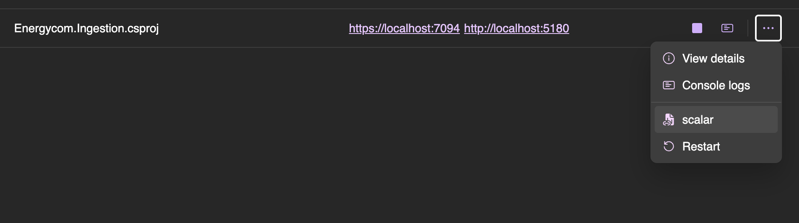
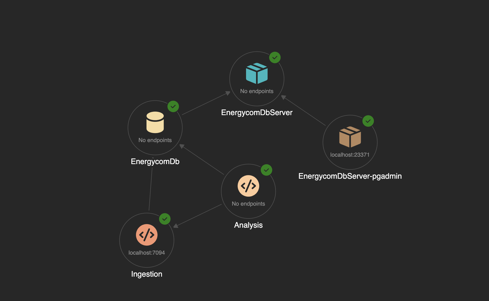

# Installation & setup instructions
### Pre-requisites

- install [dotnet 9](https://dotnet.microsoft.com/en-us/download/dotnet/9.0) 
- install [docker](https://www.docker.com/) 


Navigate to the /src folder

first install the aspire workload

```bash
    dotnet workload install aspire
```

then trust the local dev cert

```bash
    dotnet dev-certs https -t
```

finally you can run the entire solution with 

```bash
    dotnet run --project Energycom.AppHost/Energycom.AppHost.csproj
```

or by running the apphost project with your IDE of choice (VSCode, Rider, VisualStudio etc). If using jetbrains rider you may like the [aspire plugin](https://plugins.jetbrains.com/plugin/23289--net-aspire) which has many useful features such as restarting individual projects without the apphost, auto adding the database to your databases window whilst running etc. 

### Aspire

The application runs in dotnet [aspire](https://learn.microsoft.com/en-us/dotnet/aspire/get-started/aspire-overview). This is analogous to docker compose with some extra bells and whistles to make local dev easier. Aspire acts as an orchastrator, an open telemetry/structured logging/metrics sink and as a resource dashboard. When you run the aspire host it starts all dependant projects. If you run this in debug all projects will run in debug in seperate processes.

When running the apphost a dashboard will be spun up. This should automatically open but the link should appear in your logs in case it is not.


The dashboard exposes all of the resources, their health and their relavant urls. A context menu in available for each resource by hitting the three dots. The ingestion project has api documentation in this context menu by selecting the 'scalar' option.


Aspire is new and is experiencing rapid iteration so there are some rough edges. Running the aspire application should succeed and all elements should function, although there may be issues in the logic of the code. If you have technical issues with this step please reach out by email to kevin.obrien@kaima.dk and martin.grunbaum@kaima.dk although please do check the [troubleshooting section](https://learn.microsoft.com/en-us/dotnet/aspire/) before reaching out :) 

The aspire dashboard exposes all environment variables such as injected connection strings, urls and configuration etc.  by selecting 'View Details' in the resource context menu


These may or may not be useful to you depending on how you go about solving the take home assignment. 

# Take-home assignment
## Take-home requirements
- You **should** spend up to, but no more than 4 hours writing code on this assignment. Setup time is not included in this timeframe. Write down how long you spent at the end.
- You **must** build the application in a way where someone else could take it over and continue work on it.
- You **must not** use LLM's to solve any part of this task.
- You **must** keep the README.md file up-to-date in terms of installation and setup instructions. If we cannot run your solution, we cannot assess your take-home. 
- You **must** use git and git commits as you work on the project. We'll be checking the commit history and contents as part of our assessment.
- You **may** document your reasoning, priorities and general thoughts as you go along, in the [THOUGHTS.md](THOUGHTS.md) markdown file.
- You **must not** change the code or contents of the project called `EnergyCom.Ingestion` - consider it a black box that simply creates data.
- You **may** add whatever extra projects you'd like, and tweak the others, as long as you remember to leave instructions on how to run them and set them up in this file.

## Backstory
You are a developer at EnergyCom, an electricity company that manages thousands of electricity meters across multiple countries. You’ve taken over a codebase left behind by a developer who didn’t finish the project before leaving, and we’d like you to finish what they started. The aim of the project is to produce an Analysis application that can answer high-level questions based on reading raw data.

## Your task
We would like you to implement whatever is necessary for an EnergyCom.Analysis project to provide answers to these questions:

- How much electricity is produced by our devices?
- What devices do we have, and what information do we have on them?
- Any other information you find pertinent to make available, based on the raw data and what you can imagine it could be used for.

At bare minimum there must be callable methods that provide answers to the questions above, and it must be possible to run the application 
and get at that information - whether through the commandline, a dashboard, raw files or whatever you find appropriate.

The previous developer started Energycom.Analysis, which has methods to retrieve data from the API and database directly. You are free to continue with this program 
or you may create your own (in whatever programming language you prefer). All of the relevant code in this project is in program.cs . This project will still be useful to help you understand what kind of data you are dealing with. Additionally there is API documention at a /scalar endpoint on the ingestion service. You can find this endpoint in the aspire dashboard, or use the helper method to reach this.



### Existing Architecture

The current architecture of the solution is as shown.



The ingestion service writes raw readings to the energycom db. The sample anaylsis project reads data from both the ingestion service and energycom db.

These services are wired for resilience with time-outs. If you are debugging this may cause you to see task cancelled exceptions. If you would prefer not to see this behaviour you can comment out the line

```csharp
   http.AddStandardResilienceHandler();
```

at `Energycom.ServiceDefaults/Extensions.cs` which configures various health and service defaults for all projects in the solution.


### Helpful starting tips

Take a look at the scalar api documentation at /scalar under the ingestion project for hints at what is currently available.
There is a reset method on readings to clean out readings in case that is desirable for you.

This aspire dashboard exposes a preconfigured pg-admin for the db server for your convienance but feel free to use any other database management tool of your choice.

This dahsboard exposes metrics, structed logging and tracing capabilities. It might be important to keep an eye on the logs. 

The Energycom.Analysis project is automatically wired to post logs and traces here. 

*NB* There is a current issue with aspire where exposed containers require the aspire app-host to be running to access them (due to some configured docker proxy settings). In other words if you need to query the database the app host project needs to be running. This is a known limitatio and is actively being worked on my msft.


